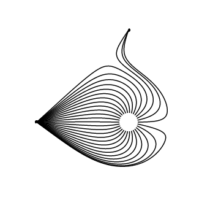

# Electric Field Simulator and Art Creator
I'm excited to announce my electric field simulator and "electric field art" creator. This project started when I learned about the electric field in my Physics class and wanted to simulate it in Elm. The results are totally beyond my conception of electric fields from the textbook. Here are some pieces I made with this tool:

 


 


## Try it out yourself [here](https://alienkevin.github.io/electric-fields/) (Recommend opening in Chrome)


# What I learned
## Physics + CS + Art = Magic!
Electric fields are based on a very simple idea: like charges repel and opposite charges attract. However, we can form countless interesting lines and shapes by adjusting the position, strength, and sign of the charges. Because these shapes follow the law of electricity, they form peculiar symmetries, curves, and layers. Maybe this is just the magic of nature. If you are interested in digital art and how to create art using Elm, definitely check out Noah Z Gordon's [Generative Art in Elm](https://www.youtube.com/watch?v=H_cXdR4JtXk). It's a great inspiration for me and one of the best demonstrations of the power of Elm in making art.

## It's possible to go without JS
I probably don't need to explain why I try my best to avoid JS. On most of my previous Elm projects, I usually resort to JS when doing stuff that is more involved with the browser API like getting the window width and handling touch events. This time, however, I looked harder and found many useful Elm implementations for complicated tasks like dragging and tapping ([elm-draggable](https://package.elm-lang.org/packages/zaboco/elm-draggable/latest/)) and handling context menu ([elm-pointer-events](https://package.elm-lang.org/packages/mpizenberg/elm-pointer-events/latest/)).

## It's possible to go without CSS
Compared to JS, I had a better experience with CSS. However, I still remembered me spending hours figuring out how to precisely select the element I want and how cascading and inheritance can mess it all up. Again, awesome Elm solutions like [elm-ui](https://package.elm-lang.org/packages/mdgriffith/elm-ui/latest/) and [typed-svg](https://package.elm-lang.org/packages/elm-community/typed-svg/latest) saved my day.

By using elm-ui, I can
* Layout all components in intuitive ways through `row`, `column`, and alignment attributes
* Style individual elements locally in the Elm view code with just the right amount of style inheritance
* Extract common styles into an Elm record for reuse
* Show and hide elements according to model state
* Opt into HTML and CSS with `html` and `htmlAttribute` when interacting with Svgs and more complicated attributes and events

By using typed-svg, I can
* Write mostly strongly typed Svg view code
* Dynamically interact with the model through clear messages
* Create neat effects like [radial-gradient](https://github.com/AlienKevin/electric-fields/blob/7e6e89ba0279c5e3ee1a1d050b0fe5d0a443d27a/src/Main.elm#L1087-L1099) and [breathing highlight](https://github.com/AlienKevin/electric-fields/blob/7e6e89ba0279c5e3ee1a1d050b0fe5d0a443d27a/src/Main.elm#L1129-L1135).

## It's possible to optimize speed for free
The electric field simulation is fairly intense in calculations. Each point on the field line requires summing up the electric field vector from all charges. One whole line requires running the Euler's method hundreds of times to get a smooth curve. The initial load time of simulation is ok but there are long lags when dragging or scaling charges. There are probably some clever ways to optimize the calculations for electric fields to reduce those lags. However, I applied a simple principle used by many 3D design tools: lower display quality when moving and restore back to the original quality when stopped. I essentially [decreased the accuracy](https://github.com/AlienKevin/electric-fields/blob/7e6e89ba0279c5e3ee1a1d050b0fe5d0a443d27a/src/Main.elm#L391-L408) of the field lines when the user is dragging or scaling the charges and [restored back to original accuracy](https://github.com/AlienKevin/electric-fields/blob/7e6e89ba0279c5e3ee1a1d050b0fe5d0a443d27a/src/Main.elm#L416-L433) when the user released their control.

# Future Plans
1. Store the current piece in local storage, load and save pieces
2. Support more style configurations
  - field line thickness
  - field line color
  - charge color
  - background color
3. Support line and shape charges
4. 3D electric field?
5. Animation of charge position, magnitude, and sign?

# Questions
1. ⭐ I'm a beginner to electricity so I still can't think of a way to implement more complex shaped charges like lines, circles, and polygons. If anyone has an idea please help me!
2. I tested this on Chrome, Firefox, and Edge and discovered that dragging and other controls are only workable on Chrome as they are too slow on Firefox and Edge. Does anyone have some ideas as to why this happens? Is it because Firefox and Edge don't optimize for SVG graphics enough?
3. This simulator shows a blank screen on android but seems to work on iOS. Does anyone know why and how to fix?

# More art works

## Titled works

### Big Family


### People


## Untitled works





Like what you are seeing? Create some cool electric field art yourself @ https://alienkevin.github.io/electric-fields/

# Development
1. Install [elm-live](https://github.com/wking-io/elm-live).

2. At the project root directory, start elm-live server
```
sed -i 's+src="elm.js"+src="/public/elm.js"+' public/index.html
elm-live src/Main.elm --start-page public/index.html --host 0.0.0.0 -- --output=public/elm.js
```

# Deployment
At the project root directory, run `build.sh` to create an optimized and minimized build:
```
./build.sh
```

# License
<a rel="license" href="http://creativecommons.org/licenses/by-sa/4.0/"></a><br />This work is licensed under a <a rel="license" href="http://creativecommons.org/licenses/by-sa/4.0/">Creative Commons Attribution-ShareAlike 4.0 International License</a>.